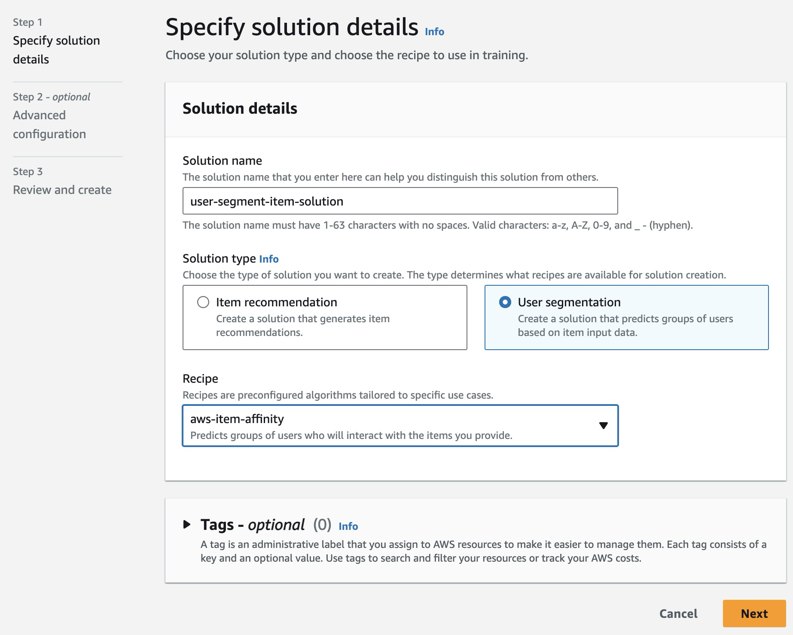

# Marketing Content Generator

Marketing Content Generation and Distribution powered by Generative AI

Leverages Amazon Bedrock, Amazon Personalize and Amazon Communications Developer Services (Amazon Pinpoint and Amazon Simple Email Service)

## License

This library is licensed under the MIT-0 License. See the LICENSE file.

## Demo Video

<video src="videos/MarketingPortal.mp4" controls title="Generative AI Marketing Portal Demo"></video>

## Prerequisites

Please make sure you have installed the following tools, languages as well as access to the target AWS account:

- [AWS CLI](https://cdkworkshop.com/15-prerequisites/100-awscli.html)
- [AWS Account and User](https://cdkworkshop.com/15-prerequisites/200-account.html): we suggest configuring an AWS account with a profile `$ aws configure --profile [profile-name]`
- [Node.js](https://cdkworkshop.com/15-prerequisites/300-nodejs.html)
- [IDE for your programming language](https://cdkworkshop.com/15-prerequisites/400-ide.html)
- [AWS CDK Toolkit](https://cdkworkshop.com/15-prerequisites/500-toolkit.html)
- [Python](https://cdkworkshop.com/15-prerequisites/600-python.html)
- [Docker Engine](https://docs.docker.com/engine/install/)

## Setup instructions

### Using Cloud9

- Follow this [link](https://docs.aws.amazon.com/cloud9/latest/user-guide/sample-cdk.html) to setup your AWS Cloud9 environment. We recommend at least a t3.small instance for this deployment.
- To prevent running out of space in later deployment steps, resize your Cloud9 EBS volume to at least 20 GB by running the following command from project root folder: (change "20" to the appropriate size that you need)

```
bash resize.sh 20
```

### Clone this repository

```
git clone https://github.com/aws-samples/generative-ai-marketing-portal
```

### Build Langchain Lambda Layer

- Ensure you're at the project root path first.

```
pushd assets/layers/langchain
docker run \
 -v "$(pwd):/var/task" \
 "public.ecr.aws/sam/build-python3.9" \
 /bin/sh -c "pip install -r requirements.txt \
 -t python/lib/python3.9/site-packages/; exit"
chmod -R 777 python/ # This might not be necessary if you're on Cloud9
zip -r langchain-layer.zip python
popd
```

### CDK Deployment

- Run the following commands to deploy the solution. The entire deployment can take up to 10 minutes.
- Install necessary requirements:

  ```
  pip install -r requirements.txt
  ```

- For local development and testing:
  ```
  pip install -r requirements-dev.txt
  ```
- Specify your deployment settings:
  ```
  vim config.yml
  ```
- You can leave most of the settings as default, but do remember to change "email_identity" to your own email address.
- Deploy cdk:

  ```
  cdk bootstrap --profile name-of-profile
  cdk synth
  cdk deploy --profile name-of-profile
  ```

- If you're using Cloud9, replace name-of-profile with the "default" profile.

- Note the CDK deployment outputs:
  - CognitoClientID
  - Endpoint
  - PersonalizeRoleARN
  - S3BucketNameOutput
  - CloudfrontDistributionDomain
- Upload sample Pinpoint user segment file (assets/demo-data/df_segment_data.csv) to Amazon Pinpoint by following the instructions [here](https://docs.aws.amazon.com/pinpoint/latest/userguide/segments-importing.html)

### Create Amazon Bedrock Model Access

1. If you have are running this solution on an account not set up to run with Amazon Bedrock, you would need to request model access to the relevant Bedrock models.
2. By default, the solution is running Claude models, so you would need to at least request access to Anthropic's Claude and Claude Instant models.
3. To do so, go to [Amazon Bedrock console](https://console.aws.amazon.com/bedrock/). Click on **Model access** on the sidebar and request the relevant model access.
   

### Create Amazon Cognito user to login to portal and setup MFA

1. Go to the [Amazon Cognito console](https://console.aws.amazon.com/cognito). Find the Cognito user pool named genai-marketer-user-pool.


2. Next, create the Cognito user by specifying a user name and provide your email address. Choose send email invitation and generate a password


3. You should receive a temporary password in your email address.
4. Use the CloudfrontDistributionDomain value above to find the URL to the marketer portal.
5. Log in using the username you've just created and the temporary password. You'll be prompted to set up a new password. Then, follow the instructions to setup MFA.


### Cleanup

1. Sometimes Cloudfront will continue to write files to the log bucket, rendering the `cdk destroy` command to fail.
2. Check and empty the Cloudfront log bucket (named "-----genaimarketercloudfrontl----") manually.
3. Remove the application by running the following command in your Cloud9 IDE

```
cdk destroy
```

4. Delete the Cloud9 IDE by opening the [Cloud9 console](https://us-west-2.console.aws.amazon.com/cloud9/home?region=us-west-2) and clicking on Delete

### [OPTIONAL] Deploy Solution Version for Amazon Personalize

- Perform the below steps if you'd like to use the Amazon Personalize batch segment as part of your user group.

- Click on AirlinesDatasetGroup


- Click on Import interaction data, then “Import data directly into Amazon Personalize datasets”, then “Next”


- Give your dataset import job a name.
- Then give the s3 import source, as part of the cdk deployment: you should have a demo interactions dataset uploaded to s3 for you similar to this:
  - s3://genai-marketer-data-<random-numbers>/demo-data/df_interactions.csv
- Input IAM Role ARN for Amazon Personalize (PersonalizeRoleARN as part of CDK deployment output)
- Similarly, repeat the above steps to import user data and item data, remember to change the source s3 dataset respectively:
  - User Data: s3://genai-marketer-data-<random-numbers>/demo-data/df_item_deduplicated.csv
  - Item Data: s3://genai-marketer-data-<random-numbers>/demo-data/df_users_deduplicated.csv
- Import jobs work in parallel, so you do not have to wait for interactions dataset to finish importing before starting import of other datasets.

Once done, confirm that all interactions, user and item datasets have been successfully imported. You should see similar to console below:


#### Solution Creation

- On the same screen, the next step you’d see is to creation a solution, click on **Create solution**:

- Specify the aws-item-affinity recipe, then just go with the default in the next two screen, click **Next** and then **Create solution**!



- This step will take sometime. While waiting, what we can do is grab the solution version ARN for our Lambda function to call.
- To do this, go to **Solutions and recipes** on the side bar and then click on the solution you’ve just created:


- Grab the latest solution version ARN as shown on the screen. You’ll need to input that as the environment variable for your Lambda function.


- Go to the [AWS Lambda console](https://console.aws.amazon.com/lambda), then find the Lambda function named: genai-marketer-personalize-batch-segment-job.
- Then go to Configuration → Environment variables → Edit. Replace the SOLUTION_VERSION_ARN with the value you’ve gotten above.

\* \* \*

### [OPTIONAL] Local Development

- If you'd like to customize the front-end streamlit webpage to your use case, you can develop locally with the following steps.
- Install streamlit requirement packages found at assets/streamlit/requirements-streamlit-dev.txt
- Create a .env file with the following content and fill in the appropriate values for each variables:

```
# Environment for local testing
CLIENT_ID = "" # Input Value of CognitoClientID
API_URI = "" # Input value of Endpoint
REGION = "" # Input value of the region you've deployed your solution (e.g. us-east-1)
AWS_ACCESS_KEY_ID="" # Input value of the temporary AWS key, secret for your admin account or a user with the appropriate permission
AWS_SECRET_ACCESS_KEY="" # Input value of the temporary AWS key, secret for your admin account or a user with the appropriate permission
BUCKET_NAME = "" # Input value of S3BucketNameOutput
COVER_IMAGE_URL = "" # Input URL of image (publicly accessible) that you'd like to use as the cover image (authenticated)
COVER_IMAGE_LOGIN_URL = "" # Input URL of image (publicly accessible) that you'd like to use as the cover image of the login page (unauthenticated)
```

```
cd assets/streamlit/src
streamlit run Home.py
```

## Solution Architecture


## User Storyflow

| **Use Case**                         | Sample Screen                                                            | User Story                                                                                                                                                                                                                                                                                                                                                                                                                                                                                                                                                                            | **Comments/Clarifications**                         |
| ------------------------------------ | ------------------------------------------------------------------------ | ------------------------------------------------------------------------------------------------------------------------------------------------------------------------------------------------------------------------------------------------------------------------------------------------------------------------------------------------------------------------------------------------------------------------------------------------------------------------------------------------------------------------------------------------------------------------------------- | --------------------------------------------------- |
| User Segmentation Upload             |                      | As a marketer, I want to be able to upload a .csv file of my customer data/segment to the portal with relevant customer metadata.The customer metadata can be stored for prompt engineering later.Once satisfied, I can confirm the user segment to be used.so that I can use the user data to generate marketing content.                                                                                                                                                                                                                                                            | Currently use Amazon Pinpoint for segmentation      |
| Item-User Segment Recommendation     |                               | As a marketer that wants to promote one or a few products, I want to have an interface that I can use to filter down to the relevant products to promote to customers.So that my customers will get the most relevant product recommended to them and I can meet my KPI for recommending those products.                                                                                                                                                                                                                                                                              | Currently use Amazon Personalize for recommendation |
| Item-User Segment Recommendation     |                         | Once I have confirmed the product(s) to be promoted, the system generates a segment of recommended customers that are most likely to purchase my product.I can then choose to confirm this segment of customers to be used for prompt engineering and content generation later on.                                                                                                                                                                                                                                                                                                    | Currently use Amazon Personalize for recommendation |
| Marketing Content Prompt Engineering |                       | As a marketing content specialist, I want to be able to have a “Prompt Generation” page where I can:Input my initial marketing content prompt, Pull in relevant customer/user meta data.Provide an auto-prompt LLM to refine my initial marketing prompt automatically together with number of iterations that I want so that I can refine my prompt to the LLM to achieve the desired output. More details in this blog post: [From Prompt Engineering to Auto Prompt Optimisation](https://medium.com/@philippkai/from-prompt-engineering-to-auto-prompt-optimisation-d2de596d87e1) |                                                     |
| Marketing Content Generation         |       | As a marketer, I want to iteratively go through the marketing content to inspect the generated content for each customer.I want to be able to see the data of the customer, as well as the data of the item to be recommended.I can also choose the Amazon Bedrock model to generate the content.So that I have visibility on which content is going to be sent to my customers as well as the the ability to reject and regenerate content if needed.                                                                                                                                | Use Amazon Bedrock to generate content              |
| Marketing Content Distribution       |  | As a marketer, I want to quickly send out the generated content to the distribution channel which is preferred by the customerI do not want to have to choose the specific channel or have to manually format the content to fit the channel.So that I can focus on content generation and delivering relevant targetted content to my customers without having to care about the actual delivery mechanism of the content.                                                                                                                                                           | Use Amazon Pinpoint/ Amazon SES to send out content |

## API and Lambda Functions Description

- API Gateway Endpoints found in /infra/constructs/cdsai_api.py
- Lambda functions found in assets/lambda

  | **API Gateway Endpoint** | **Lambda Function**               | **Description**                                                                                                                                                                                                                        |
  | ------------------------ | --------------------------------- | -------------------------------------------------------------------------------------------------------------------------------------------------------------------------------------------------------------------------------------- |
  | /content/bedrock         | bedrock_content_generation_lambda | Calls Amazon Bedrock and provide the relevant user/item metadata to generate marketing content                                                                                                                                         |
  | /pinpoint/segment        | pinpoint_segment                  | Fetch all segments available in Amazon Pinpoint.                                                                                                                                                                                       |
  | /pinpoint/job            | pinpoint_job                      | If GET, get the segment export job status. If POST, create the segment export job.                                                                                                                                                     |
  | /pinpoint/message        | pinpoint_message                  | Sends a message (email, SMS, push notification) using Amazon Pinpoint.                                                                                                                                                                 |
  | /s3                      | s3_fetch                          | Since Amazon Pinpoint can upload segment data in multiple files and Personalize will upload segment data in 1 file, this function will take care of finding and stitching the file and return the URI to access the file in streamlit. |
  | /batch-segment-jobs      | personalize_batch_segment_jobs    | Fetch all current batch segment jobs information in Amazon Personalize                                                                                                                                                                 |
  | /batch-segment-job       | personalize_batch_segment_job     | If GET,describe the Amazon Personalize job status. If POST, create an Amazon Personalize batch segment job.                                                                                                                            |

## Contributors

Tristan Nguyen (@nnatri) [LinkedIn](https://www.linkedin.com/in/nguyennhianhtri/)

Philipp Kaindl (@philikai) [LinkedIn](https://www.linkedin.com/in/philipp-kaindl/)
